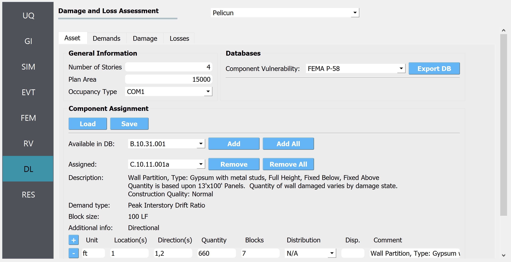
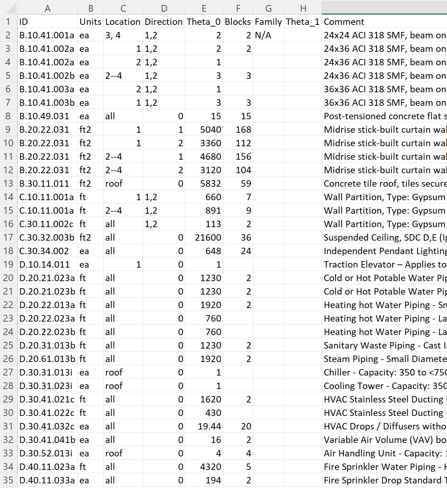
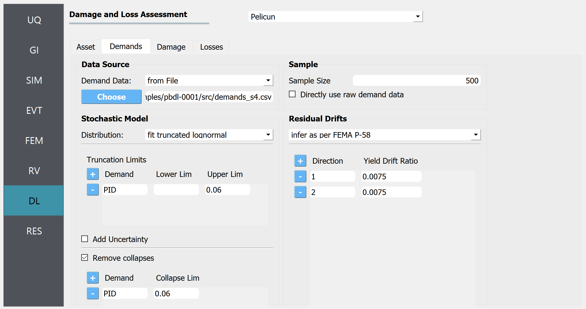
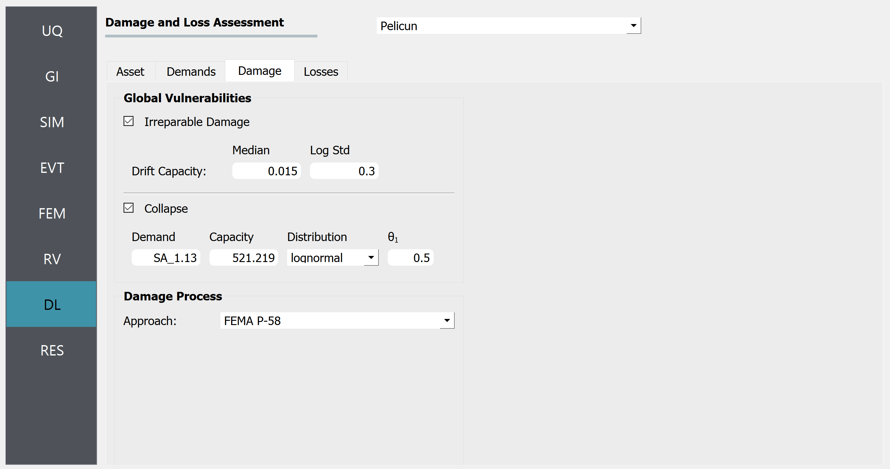

.. _pbdl-0001:

FEMA P-58 Assessment Using External Demands
===========================================

This example focuses on the seismic performance assessment of a steel moment frame structure using the FEMA P-58 method. We look at demand, damage, and loss modeling in and show the inputs provided to PBE to perform the simulations.

The file ``input.json`` contains all of the settings for this exercise. It can be opened (using File/Open) to automatically populate the fields in the user interface.

The demands and the performance model for this example are based on the example building featured in FEMA P-58. More details are available in the following FEMA P-58 background documentation:

he FEMA and ATC logos. The document is prepared by Curt Haselton and Travis Churpalo of California State University, Chico, and submitted to the Applied Technology Council and prepared for the Federal Emergency Management Agency. The address of FEMA in Washington, D.C. is provided at the bottom.
   :width: 400
   :figclass: align-center

In this example, we are going to import demand data from simulations that were run outside of the PBE tool. This feature allows researchers to use PBE only for the performance assessment part of the workflow and connect it with any other response estimation solution they prefer to use. Because we do not need the response estimation part of the workflow for this example, we only need to focus on the **DL** panel in PBE.

DL - Asset Model
~~~~~~~~~~~~~~~~

The first tab in the **DL** panel defines the asset model. The asset model assigns components to the building and defines where they are and how much of each component is at each location.

or "Occupancy Type". Below is a "Component Assignment" section with Load and Save buttons, lists for available and assigned components, and buttons to add or remove these components. In the bottom pane, there's a detailed entry for a wall partition component, including type, quantity, blocks, and additional specifications.
   :figclass: align-center

The asset model can consider uncertainties in the types of components assigned and in their quantities. This example does not introduce those uncertainties for the sake of simplicity. Consequently, for this example, the component types and their quantities are identical in all realizations.

Pelicun provides a convenience method for defining the asset model. We can prepare a table (see the figure below) where each row identifies a component and assigns some quantity of it to a set of locations and directions. Such a table can be prepared in Excel or in a text editor and saved in a CSV file - like we did in this example, see CMP_QNT.csv. Such a file is automatically created by PBE when the asset model is set up using the user interface. It can also be manually saved or the settings can be loaded from a file using the Load and Save buttons under **Component Assignment** Storing these models in a CSV file facilitates sharing the basic inputs of an analysis with other researchers.

s beneath. The data includes references to architectural components, measurements, and types of installations like HVAC, piping, and fire sprinkler systems. The spreadsheet layout is standard with grid lines separating the cells, and some column headers are highlighted in gray.
   :figclass: align-center

The tabular information in the csv file follows the information provided at the bottom of the Asset Model panel where the selected component is assigned to various locations and directions in the building.

We selected the built-in FEMA P-58 Component Vulnerability Database for this analysis and set the General Information features and component characteristics following the referenced example problem.

DL - Demand Model
~~~~~~~~~~~~~~~~~

The first tab defines the demand model.Under ``Data Source`` we specified that the demands are provided in a file and specified the location of that file.

th the selected option "DL". The main window is split into tabs labeled "Asset", "Demands", "Damage", and "Losses". The "Demands" tab is active, displaying sections for "Data Source", where a file can be chosen, "Stochastic Model" with drop-down options for distribution type, and configurable truncation and collapse limits. On the right, there is a "Sample" section for setting sample size and raw data usage, as well as "Residual Drifts" where drift ratios for two different directions can be inputted, referencing FEMA P-58 for inference. The design is clean with a color scheme of blues, grays, and white.
   :figclass: align-center

Demand distribution data was extracted from the FEMA P-58 background documentation referenced in the Introduction. The nonlinear analysis results from Figures 1-14 – 1-21 provide the 10th percentile, median, and 90th percentile of EDPs in two directions on each floor at each intensity level. We used that information to fit a lognormal distribution and sample 50 realizations of EDPs that follow the data provided for stripe #4 in the original example. The EDP data is stored in the ``demands_s4.csv`` file:

.. figure:: figures/demand_data.png
   :align: center
   :alt: An Excel spreadsheet filled with numerical data across columns labeled from A to K and rows numbered from 1 to 23. Each cell contains a decimal value, with data organized in a systematic, tabular format. This appears to be some sort of dataset, possibly related to scientific or statistical research.
   :figclass: align-center

The header of the table uses the standard SimCenter demand naming convention to identify the type, location, and direction of each EDP. Each row corresponds to one realization - such data typically would come from dynamic analysis.

One the demands are imported, the settings in the panel instruct Pelicun to fit a truncated lognormal distribution to the data considering everything above a peak interstory drift (PID) of 6% as collapsed cases. Then, sample the fitted multivariate distribution to get 500 demand realizations and use the methodology from FEMA P-58 to infer residual drifts based on PID values.

DL - Damage Model
~~~~~~~~~~~~~~~~~

We have already identified the components in the buildings and the component database includes the fragility functions that characterize component vulnerabilities through probabilistic capacities corresponding to various limit states.

We use the Damage Model tab to extend the above dataset with two Global Vulnerabilities: Irreparable Damage and Collapse.

'Irreparable Damage' with median and log standard deviation sliders, and 'Collapse' with inputs for Demand, Capacity, Distribution, and Theta 1. "Damage Process" shows an approach dropdown menu with selection "FEMA P-58". On the left side, there's a vertical menu with options UQ, GI, SIM, EVT, FEM, RV, DL (highlighted), and RES.
   :figclass: align-center

Irreparable damage is triggered when the residual drift of any story in the structure exceeds a pre-defined threshold. We use the recommended values from FEMA P-58 for that threshold here.

Following the typical approach in FEMA P-58 performance assessment, the collapse limit state is characterized by a collapse fragility function. The controlling variable is an IM, the spectral acceleration at T1=1.13 s. Given the multi-stripe setup of the example problem, all realizations at one stripe have the same Sa(T1) value. This value is added for every realization using an extra column in the ``demands_s4.csv`` file. The capacity, distribution, and theta_1 parameters are used to define the lognormal fragility function. Note that the capacity is provided in inches/s2 because the length unit for the analysis in the **GI** panel is set to inches.

We use the built-in FEMA P-58 damage process for this example.

DL - Loss Model
~~~~~~~~~~~~~~~

Consequence modeling is decoupled from damage modeling in Pelicun. The Loss Model tab is used to identify the consequence database for each type of consequence we would like to include in the analysis and map the consequence models to the damaged components. This process is trivial if one wants to follow the FEMA P-58 methodology and the mapping is performed automatically by the PBE tool.

.. figure:: figures/loss_model.png
   :align: center
   :alt: Screenshot of a damage and loss assessment interface titled "Pelican" with various input sections for an asset's demands, damage, and losses. It includes fields for global consequences cost and time with editable parameters such as unit, median, distribution, and θ. The cost is set to "USD_2011" with a median value of "12500000" and a normal distribution, whereas the time is measured in "worker_day" with a median value of "15000" and a lognormal distribution. There are checkboxes for replacement, an export database button that says "Export DB," and dropdown menus for selecting consequence data and mapping approach. The sidebar contains vertical tabs labeled UQ, GI, SIM, EVT, FEM, RV, DL, and RES, with the DL tab highlighted.
   :figclass: align-center

We use this panel to add a replacement consequence to the FEMA P-58 dataset. This defines a replacement cost and time and the automatic mapping links these consequences with the collapse and irreparable damage events. Note that the replacement consequences are defined using random variables in this example to capture the uncertainty in those numbers. The deterministic replacement values that FEMA P-58 uses can be reproduced in PBE by choosing N/A for the Distribution of Cost and Time.

Analysis & Results
~~~~~~~~~~~~~~~~~~

Once the performance assessment has been set up in the **DL** panel, click on the **Run** button. When the analysis is complete the **RES** tab will be activated and the results will be displayed. The **Summary** and **Data** tabs of the results panel are shown below.

.. figure:: figures/1_RES_summary.png
   :align: center
   :alt: Screenshot of a data summary table with columns for Decision Variable, Probability, Mean, Standard Dev., and Log Standard Dev. Listed decision variables are 'repair cost,' 'repair time - parallel,' 'repair time - sequential,' 'collapsed?,' and 'irreparable?' with numerical values provided for mean and standard deviations for cost and repair times, and probability values for 'collapsed?' and 'irreparable?' options.
   :figclass: align-center

.. figure:: figures/1_RES_data.png
   :align: center
   :alt: A screenshot of a computer interface displaying a bar chart and a data table. The bar chart is labeled "Frequency %" on the y-axis and "repair cost" on the x-axis, with figures ranging from approximately 3.07 million to 22.26 million. Bars of various heights represent different frequencies, with the first and fourth bars being the tallest. Below the chart, there's a table with columns named "repair cost," "pair time - paral," "air time - sequer," "collapsed?" and "irreparable?" Rows with numeric data correspond to these columns. The interface includes tabs labeled "Summary" and "Data Values," with the "Data Values" tab currently selected.
   :figclass: align-center

In the **Data** tab of the **RES** panel, we are presented with both a graphical plot and a tabular listing of the data. By left- and right-clicking on the individual columns the plot axis changes (left mouse click controls vertical axis, right mouse click the horizontal axis). If a singular column of the tabular data is selected with both right and left mouse buttons, a frequency and CDF plot will be displayed.