.. _pbdl-0002:

Shear Building: HAZUS Assessment
================================

This study explores a simple uncertainty propagation problem in the following three story shear building and employs the HAZUS methodology for assessing damage and loss:

.. figure:: figures/model3.png
   :align: center
   :alt: A diagram depicting a three storyone bay  structure with three horizontally aligned rigid beams. The first and second floors have a mass labeled "w". At the top floor, the mass is labeled "w/2". The columns at the based end by a symbol indicating a fixed support.
   :width: 400
   :figclass: align-center

   Three Story Shear Building Model (P10.2.9, "Dynamics of Structures", A.K.Chopra)

This example uses the PBE application to automatically prepare an column model that represents the three-story structure, subject it to a suite of ground motion time histories, and evaluate the seismic performance of the building using the Hazus Earthquake methodology.

Each step of the workflow for this problem is explained below by sequentially walking through the input panels and highlighting their role in the simulation. The file ``input.json`` contains all of the settings for this exercise. It can be opened (using File/Open) to automatically populate the fields in the user interface.

Step 1: UQ
~~~~~~~~~~~~

This panel provides an interface to various forward propagation procedures which are used to sample the random variables defined in later panels and propagate each realization through the workflow. This process can be used to characterize the uncertainty in the workflow outputs. For this example, a latin hypercube sampling procedure (**LHS**) is used with ``40`` samples and a seed of ``775``. Fixing the seed ensures the same random sample every time the calculation is run.

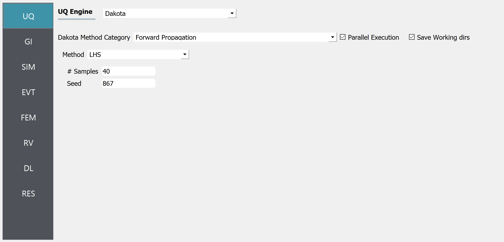s or module names. The main content area displays settings related to the "UQ Engine" with "Dakota" selected from a dropdown menu. There is a section titled "Dakota Method Category" with "Forward Propagation" selected, followed by options to choose a method ("LHS" currently selected), set the number of samples ("40"), and input a seed value ("867"). Lastly, checkboxes for "Parallel Execution" and "Save Working dirs" are visible with "Parallel Execution" checked. The layout suggests that this is a configuration panel for running uncertainty quantification (UQ) simulations or analyses.
   :figclass: align-center

Step 2: GI
~~~~~~~~~~~~

Next, the **GI** panel may be used to define metadata and other general information about the model. Some of the values are automatically updated by later panels while others are only providing information about the model and not used for the simulation.

It is important to review and specify the desired Units for the calculation here. It is important to provide all inputs assuming these units when no other instructions are given by the following panels. The length unit is used to define velocity and acceleration units as well.

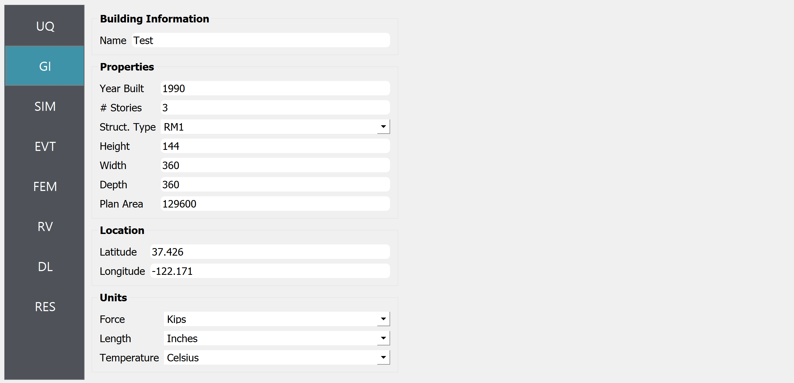ngth in inches, and temperature in Celsius). The building name is entered as "Test", the year built is "1990", and it has "3" stories with a "RM1" structural type. No image of the actual building is present, just the data entry interface.
   :figclass: align-center

Step 3: SIM
~~~~~~~~~~~~

The **SIM** panel can be used to define the simulation model. In this example we leverage the convenient MDOF tool which provides a high-level interface for defining simple parameterized structural analysis models. Either variable names, or literal values can be entered in the fields of this panel, as shown in the following figure.

This model could have random properties that we could sample and propagate the corresponding uncertainty through the workflow. If a variable name is entered, PBE automatically identifies it as a random variable, and creates a corresponding entry in the **RV** panel. Several examples in the documentation of the EE-UQ application demonstrate this feature on models of various complexity. In this example, we use a deterministic structural model for the sake of simplicity.

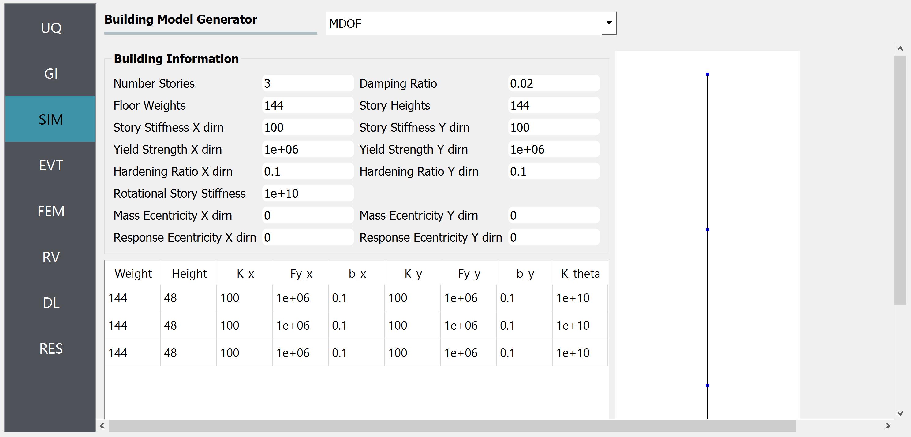selected. The central panel titled "Building Information" includes data input fields for properties such as Number of Stories, Floor Weights, Story Stiffness in X and Y directions, Yield Strength, Damping Ratio, and others, with numerical values entered. To the right is a simple representation of a multi-degree of freedom (MDOF) system with three horizontal blue squares, symbolizing floor masses, connected by vertical lines, indicating the building model's response to simulations.
   :figclass: align-center

Step 4: EVT
~~~~~~~~~~~~

The **EVT** panel provides various **Load Generator** options that can either import ground motion loads from external files or connect to the PEER NGA database and obtain loads that represent a target spectrum or generate loads during the simulation using a stochastic process. We will use the latter solution in this example by selecting the **Stochastic Ground Motion** option.

The Vlachos et al. (2018) model generates ground motion time histories based on three parameters: magnitude, distance, and shear-wave velocity in the top 30 meters of the soil. We specify a magnitude ``7`` earthquake ``40`` kms from the site of interest. As for the shear-wave velocity, we introduce a random variable by providing ``vs`` as input. This is recognized by PBE and the corresponding variable is automatically added to the **RV** panel.

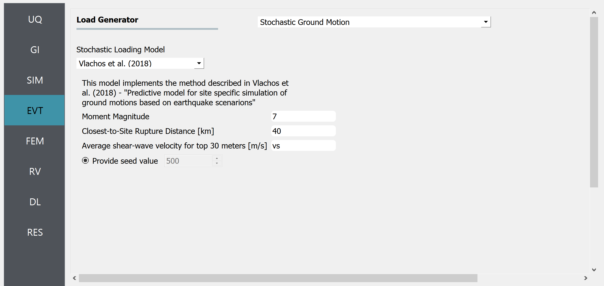st-to-Site Rupture Distance in kilometers (set to 40), and Average shear-wave velocity for the top 30 meters in meters per second (labeled 'vs'), with a radio button for providing a seed value (set to 500). There is a navigation sidebar on the left with various options like UQ, GI, SIM, EVT (selected), FEM, RV, DL, and RES.
   :figclass: align-center

Step 5: FEM
~~~~~~~~~~~~

We now proceed to the **FEM** panel where we can adjust settings for running the dynamic analysis. The default settings are typically appropriate for analyses that use the MDOF tool.

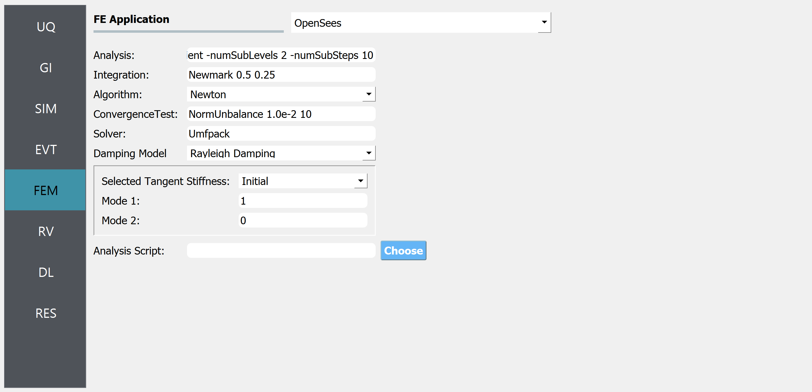ss. Each category has predetermined choices or numerical inputs, with a 'Choose' button at the bottom right. On the left sidebar, 'FEM' is highlighted, indicating the current section the user is in, with other sections like UQ, GI, SIM, EVT, RV, DL, and RES listed above and below.
   :figclass: align-center

Step 6: RV
~~~~~~~~~~~~

Now in the **RV** panel we will enter the distributions and values for our random variables. Because of the steps we have followed and entries we have made, when this tab is opened it already contains the ``vs`` random variable. We choose to model the uncertainty in the shear wave velocity using a normal distribution with a mean of 400 m/s and a standard deviation of 100 m/s.

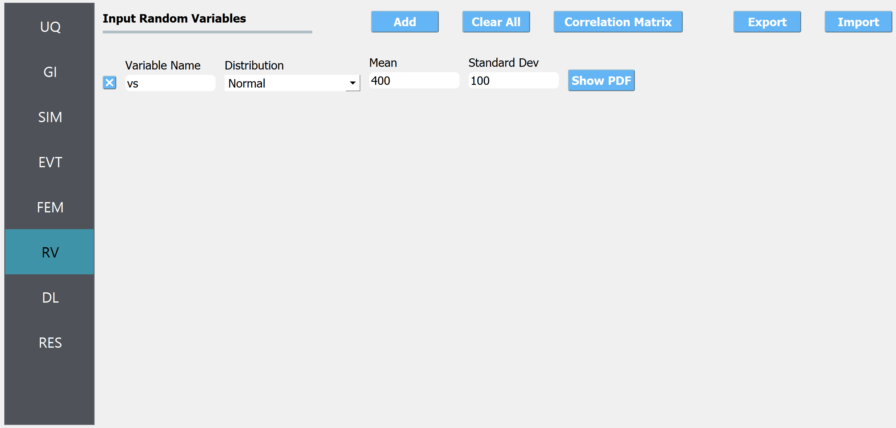ariable Name (populated with 'vs'), Distribution (set to 'Normal'), Mean (set to '400'), and Standard Deviation (set to '100'). There are buttons for 'Add', 'Clear All', 'Correlation Matrix', 'Show PDF', 'Export', and 'Import'. The background and menu are dark gray, while the main panel has a white background with blue highlights.
   :figclass: align-center

.. warning::

   Do not leave any of the distributions for these values as constant when using the Dakota UQ engine.

Step 7: DL
~~~~~~~~~~~~

The last step in the setup is the **DL** panel. We use the four tabs in this panel to specify the performance model following the Hazus Earthquake methodology.

First, in the Asset tab, we choose the ``Hazus Earthquake`` component vulnerability database that is bundled with the PBE application. This loads all of the building archetypes handled by Hazus in the ``Available in DB`` list. We assign the ``STR.S1M.MC`` steel frame archetype as the structural component. ``NSD`` and ``NSA.MC`` components are added to represent drift and acceleration-sensitive non-structural components.

Because Hazus components are assigned at the building level, there is only one performance group created for each. The acceleration-sensitive component is assigned to the roof of the building (to obtain roof acceleration from there) while the drift-sensitive components are assigned to the first floor. This latter assignment is used with roof drift EDPs in buildings regardless of the number of floors they have.

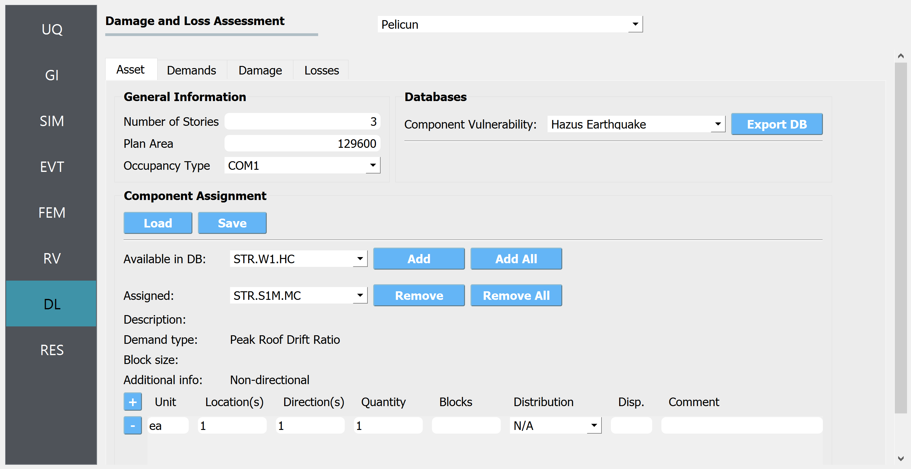tion for Component Assignment is shown with buttons for 'Load', 'Save', 'Add', 'Add All', 'Remove', 'Remove All', and lists 'Available in DB' and 'Assigned' components. There is a portion labeled 'Databases' with a dropdown menu for 'Component Vulnerability' currently set to 'Hazus Earthquake' and a button to 'Export DB'. The interface also includes vertical navigation tabs on the left side with labels such as UQ, GI, SIM, EVT, FEM, RV, DL, and RES, with the DL tab highlighted.
   :figclass: align-center

Under the Demands tab, we specify that the demand data is provided by the Workflow automatically; we assume that demands follow a multivariate lognormal distribution. After fitting such a distribution to the data, we sample 500 demand realizations for damage and loss assessment.

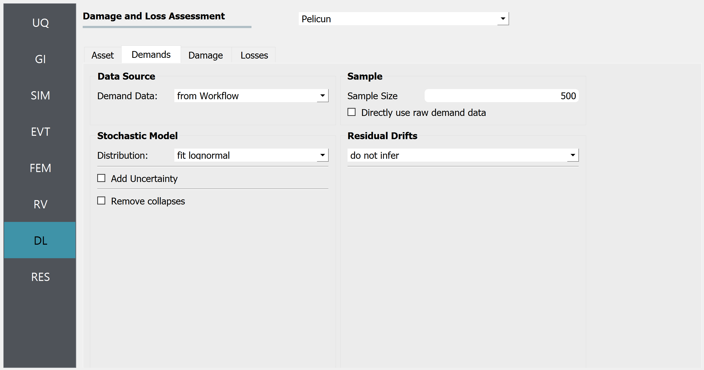not infer.' On the left side, there's a vertical menu with the options UQ, GI, SIM, EVT, FEM, RV, DL (highlighted), and RES.
   :figclass: align-center

The Damage tab setup is simple when the Hazus earthquake methodology is used because this method includes collapse in the structure component damage states and does not consider irreparable damage. The Damage Process employed by this method is included in PBE and selected for this example.

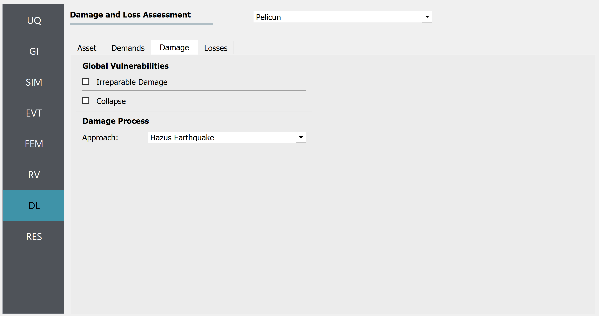ed 'Asset,' 'Demands,' 'Damage,' 'Losses' and sections titled 'Global Vulnerabilities' with checkboxes for 'Irreparable Damage' and 'Collapse,' and 'Damage Process' with a dropdown menu set to 'Hazus Earthquake.' The interface has a clean, professional layout with a grey and teal color scheme.
   :figclass: align-center

Losses are calculated using the included Hazus Earthquake consequence functions for repair costs and an Automatic mapping between damaged components and consequence models. This mapping uses the occupancy type and component types specified in the Asset tab earlier and selects the corresponding consequence functions following the Hazus methodology.

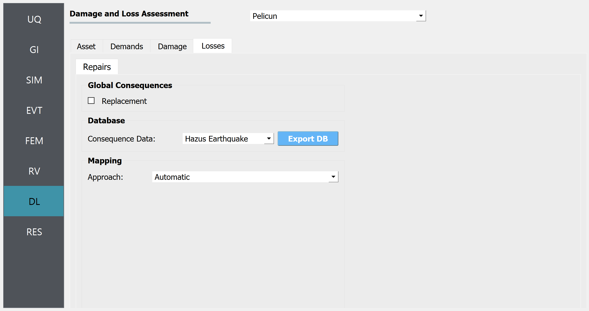ategories like Repairs, Global Consequences, Database, and Mapping on the main panel. An option to export the database is visible, and the dropdown menu shows "Hazus Earthquake" as the selected consequence data.
   :figclass: align-center

Analysis & Results
~~~~~~~~~~~~~~~~

Once a full workflow has been defined click on the **Run** button. When the analysis is complete the **RES** tab will be activated and the results will be displayed. When a HAZUS assessment has been conducted, the results panel will resemble the following figures which show the **Summary** and **Data** tabs, respectively.

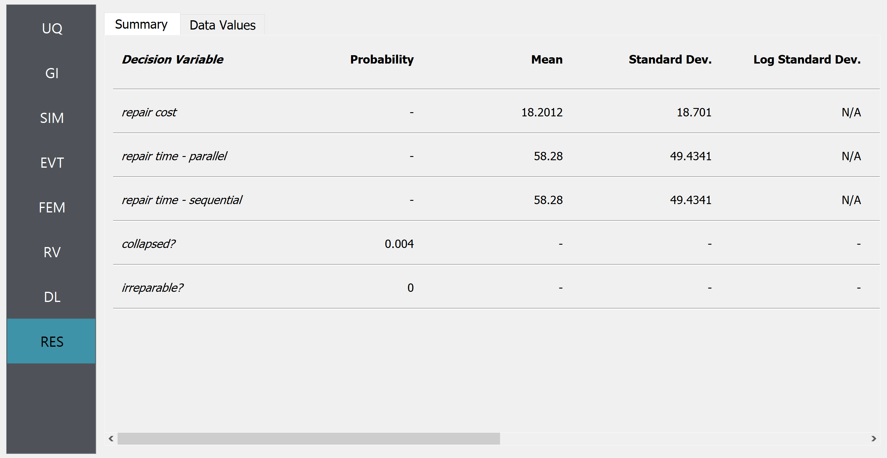ing statistical values for probability, mean, standard deviation, and log standard deviation. Some fields are filled with numerical data, while others are marked with dashes or "N/A" to indicate unavailable information.
   :figclass: align-center

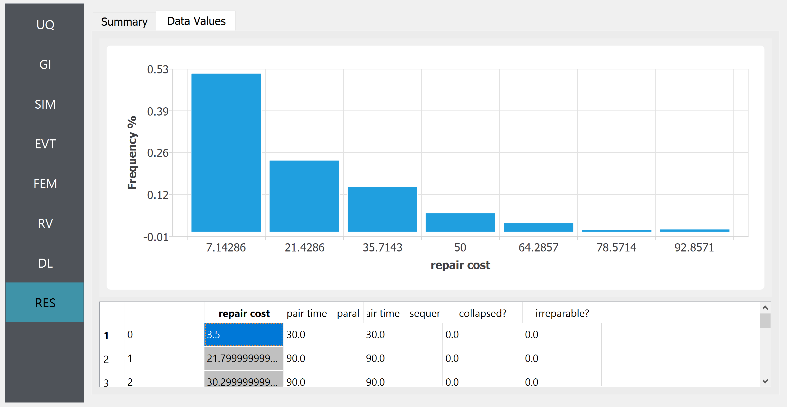e beneath the chart lists numerical values across columns with headers such as "repair cost," "pair time - paral," "air time - sequer," "collapsed?" and "irreparable?" The interface also includes a sidebar with various menu options like UQ, GI, SIM, EVT, FEM, RV, DL, and RES highlighted in turquoise.
   :figclass: align-center

In the **Data** tab of the **RES** panel, we are presented with both a graphical plot and a tabular listing of the data. By left- and right-clicking on the individual columns the plot axis changes (left mouse click controls vertical axis, right mouse click the horizontal axis). If a singular column of the tabular data is selected with both right and left mouse buttons, a frequency and CDF plot will be displayed.
