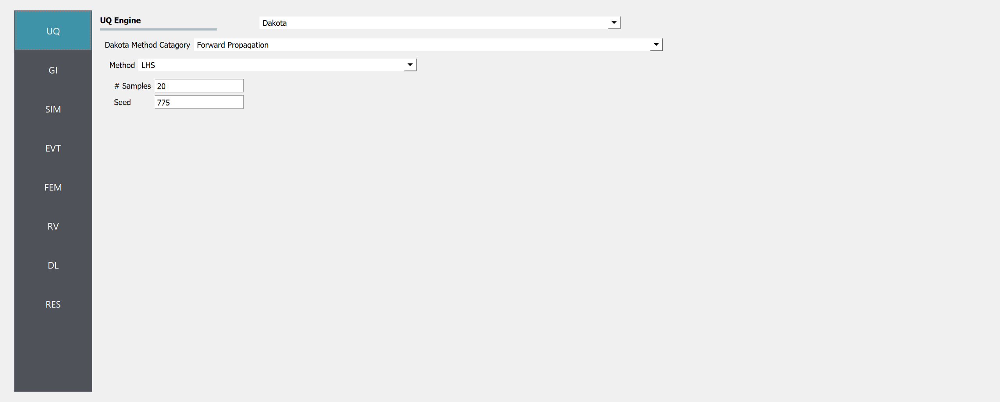
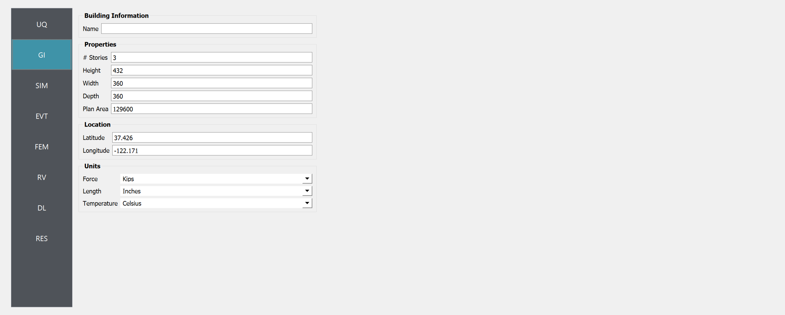
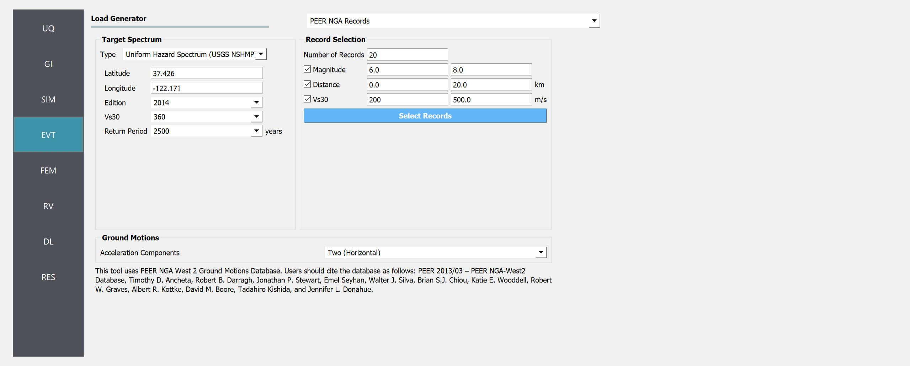
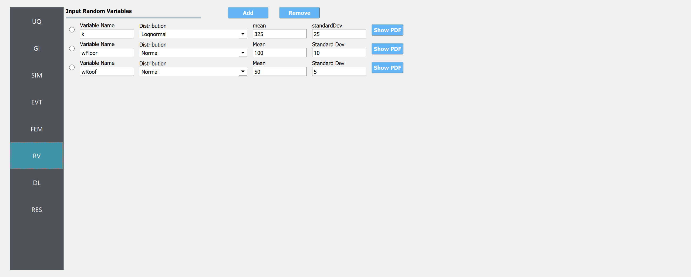
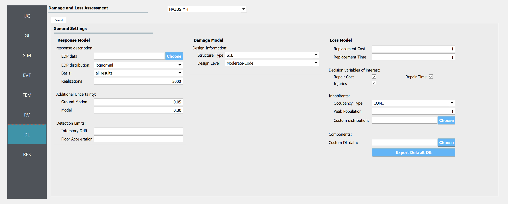
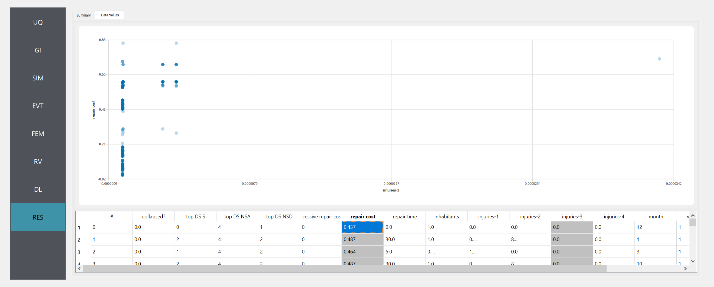
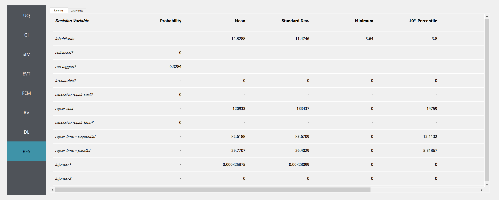

.. 
   Tested for:
   - PBE version 2.1.0
   Accompanying files:
   - HAZUS_assessment.json
   - P58_assessment.json

Shear Building: HAZUS & FEMA P58 Assessments
============================================

Consider the problem of uncertainty quantification in the following three story shear building:

.. figure:: figures/model3.png
   :align: center
   :width: 400
   :figclass: align-center

   Three Story Shear Building Model (P10.2.9, "Dynamics of Structures", A.K.Chopra)

The structure has the following uncertain properties that all follow normal distributions:

1. Weight of Typical Floor (``wFloor``): mean :math:`\mu_E=100 \mathrm{kip}` and standard deviation :math:`\sigma_E =10 \mathrm{kip}` (COV = 10%)
2. Weight of the Roof (``wRoof``): mean :math:`\mu_E=50 \mathrm{kip}` and standard deviation :math:`\sigma_E =5 \mathrm{kip}` (COV = 10%)
3. Story Stiffness (``k``): mean :math:`\mu_k =326 \quad \mathrm{kip/in}` and a standard deviation of :math:`\sigma_P = 25 \mathrm{kN}`, (COV = 12%).

This example will use the PBE application to organize both a HAZUS, and FEMA P58 damage and loss assesment of this model when subjected to a suite of ground motions selected from the PEER NGA database. 

The deterministic structural analysis model for this problem is implemented with the MDOF program, which PBE provides a built-in interface for (OpenSees may also be used for this purpose, as noted throughout). 

HAZUS Assessment with a PEER Ground Motion Suite
^^^^^^^^^^^^^^^^^^^^^^^^^^^^^^^^^^^^^^^^^^^^^^^^

We will first demonstrate the steps to perform a HAZUS style damage and loss assessment by sequentially walking through the input panels and highlighting their role in the workflow. The file ``HAZUS_assessment.json`` contains all of the data for this exercise and may be used to bypass the manual entry of data into these panels.

Step 1: UQ
~~~~~~~~~~~~

Upon opening the application, the **UQ** panel will be highlighted. This panel provides an interface to various forward propagation procedures in Dakota, which are used to strategically generate realizations of the problems random variables (i.e. "samples") which can be used to estimate statistical properties of the deterministic model's response. For this example, a latin hypercube procedure (**LHS**) is used with ``100`` samples and a seed of ``775``.

Step 2: GI
~~~~~~~~~~~~

Next, the **GI** panel may be used to define metadata and other general information about the model. However, for this exercise this panel will not be used; the default values may be left as they are, and they will be automatically updated based on the information entered in the following panels.

Step 3: SIM
~~~~~~~~~~~~

The **SIM** panel can now be used to define the deterministic simulation model which that parameterized in terms of our random variables. This model will run an analysis for each of the random variable realizations generated by the UQ procedure. In this example we leverage the convenient MDOF interface offered by PBE which allows an intuitive and high-level interface for defining simple parameterized structural analysis models. Either variable names, or literal values can be entered in the fields of this panel, as shown in the following figure. As we will see in step five, PBE will automatically identify non-numeric entries in this panel as random variables, and use this inference to automatically create corresponding entries for us in the **RV** panel.

.. figure:: figures/SIM.png
   :align: center
   :figclass: align-center

.. note::

   To specify instead to use an OpenSees model, from the **Model Generator** pull down menu select **OpenSees**. For the fields in the panel presented enter the path to the ``ShearBuilding3d.tcl`` script. Also specify three Response Nodes as ``1 2 3 4`` in the panel. This field will tell the model generator which nodes correspond to nodes at the four floor levels at which responses are to be obtained when using the standard earthquake EDPs.

   .. figure:: figures/shearSIM-OpenSees.png
      :align: center
      :figclass: align-center

Step 4: EVT
~~~~~~~~~~~~

Next we arrive at the **EVT** panel, where the **Load Generator** pull down menu presents us with a wide variety of options for quickly orchestrating loading events for our model. In this exercise we will use the **PEER NGA Records** option to connect to the PEER NGA database, which will be given the target spectrum that a user defines in this panel and return an appropriate suite of ground motion records which will be piped to the simulation model defined in the previous step. The following figures depict this panel before and after a suite of records has been pulled from the database, respectively.

.. image:: figures/EVT.png
   :width: 48%

Step 5: FEM
~~~~~~~~~~~~

We now proceed to the **FEM** panel where we are given additional options for our simulation model. We can use this panel to define a Rayleigh damping scheme with a damping ratio of ``0.05``, and Rayleigh factor chosen using the first and fifth modes of our simulation model.

.. figure:: figures/FEM.png
   :align: center
   :figclass: align-center

Step 6: RV
~~~~~~~~~~~~

Now in the **RV** panel we will enter the distributions and values for our random variables. Because of the steps we have followed and entries we have made, when this tab is opened it should contain the ``wFloor``, ``wRoof`` and ``k`` random variables for which we supplied variable names in previous panels. 

.. warning::   

   The user cannot leave any of the distributions for these values as constant when using the Dakota UQ engine.

Step 7: DL
~~~~~~~~~~~~

We now end our journey at the **DL** panel. This is where we will specify our parameters for the damage and loss assessment procedure. PBE will feed the data entered into this panel to the Pelicun Python package which will run an appropriate damage and loss assessment. The following figures show the interface we are provided upon selecting a **HAZUS MH** style assessment from the **Damage and Loss Assessment** dropdown menu:

HAZUS Results
~~~~~~~~~~~~~~~~

Once a full workflow has been defined click on the **Run** button. When the analysis is complete the **RES** tab will be activated and the results will be displayed. When a HAZUS assessment has been conducted, the results panel will resemble the following figures which show both the **Summary** and **Data** tabs, respectively.

.. image:: figures/RES-HAZUS-1.png
   :width: 45%

In the **Data** tab of the **RES** panel, we are presented with both a graphical plot and a tabular listing of the data. By left- and right-clicking on the individual columns the plot axis changes (left mouse click controls vertical axis, right mouse click the horizontal axis). If a singular column of the tabular data is selected with both right and left mouse buttons, a frequency and CDF plot will be displayed.

FEMA P58 Style Assessment 
^^^^^^^^^^^^^^^^^^^^^^^^^

We now revisit our experience with the **DL** panel to explore the interface PBE offers for a FEMA P58 style assessment. Similarly to the previous exercise, the file ``P58_assessment.json`` contains all of the problem data and may be used to bypass the manual entry of data into the UI panels.

The following figure shows a tab from the alternate **DL** panel interface which is provided when **FEMA P58** is selected from the **Damage and Loss Assessment** dropdown menu:

.. figure:: figures/DL-P58.png
   :align: center
   :figclass: align-center

When the **DL** panel is filled out in this manner and all other panels are left unchanged, the following results are rendered on the **RES** panel. Note that only some metrics are calculated by both the FEMA P58 and HAZUS style assessments while others may be absent for a given style.

