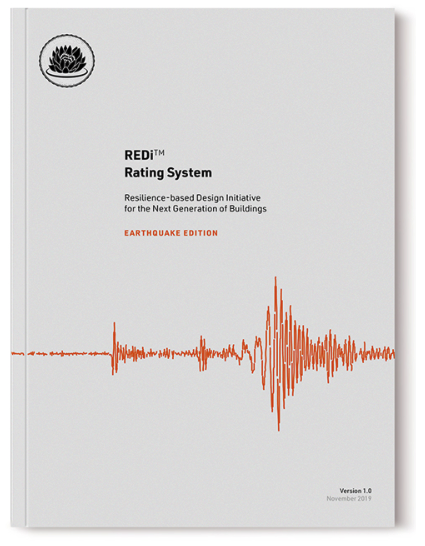
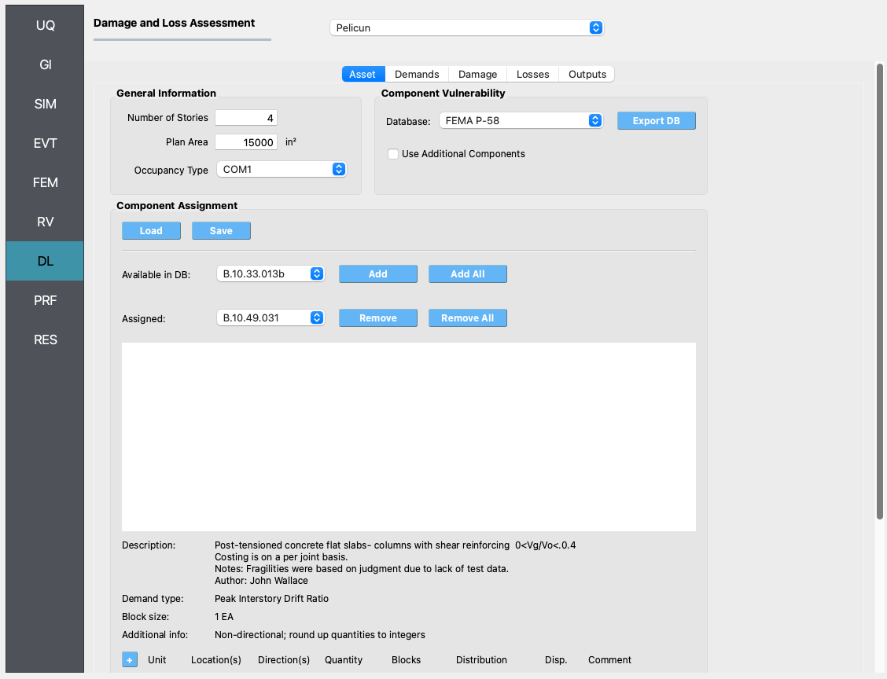
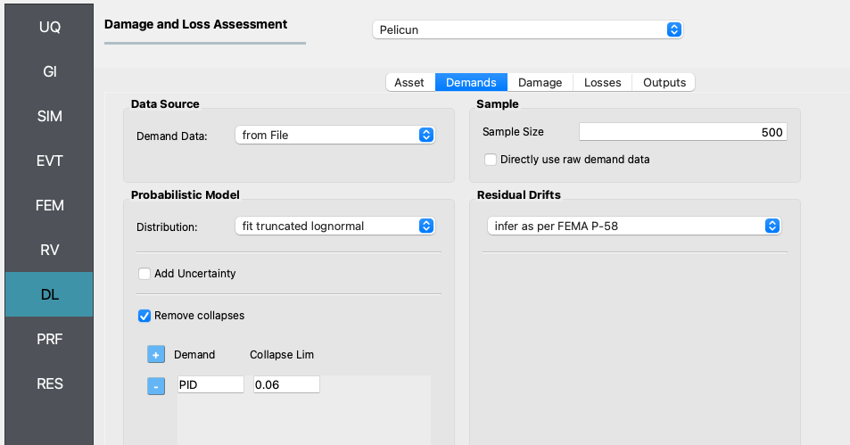
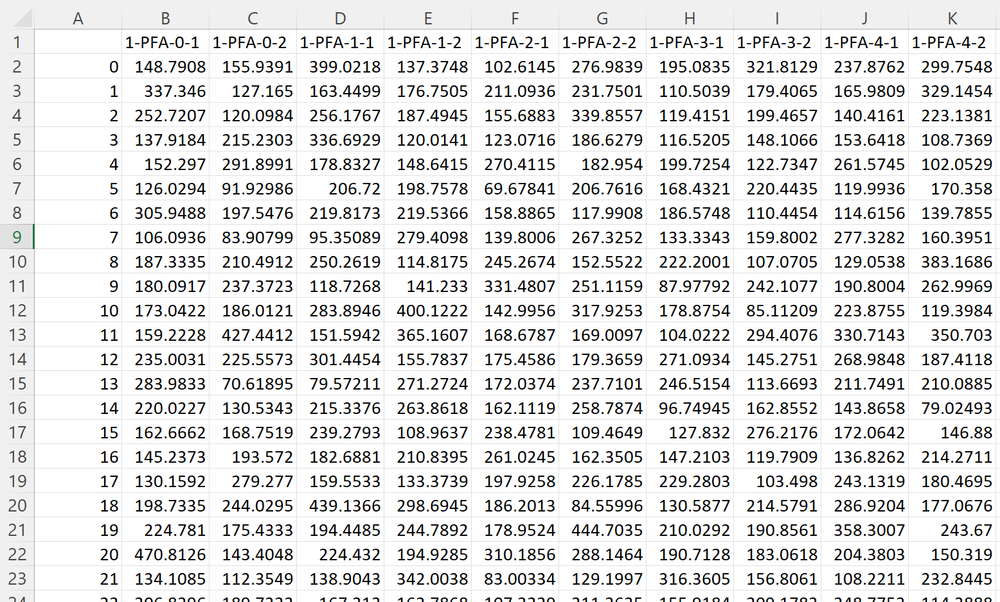
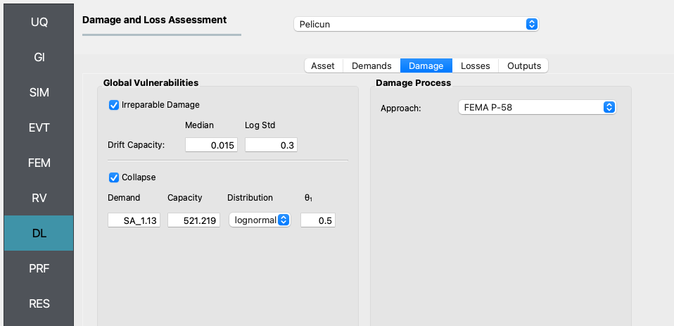
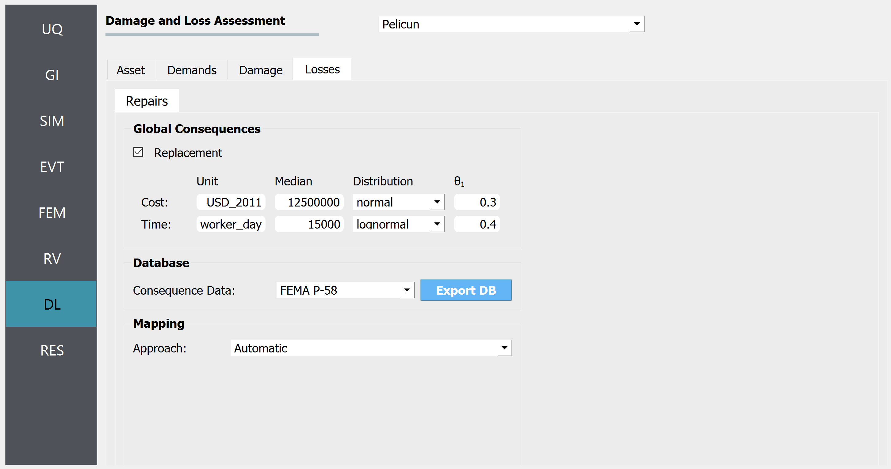
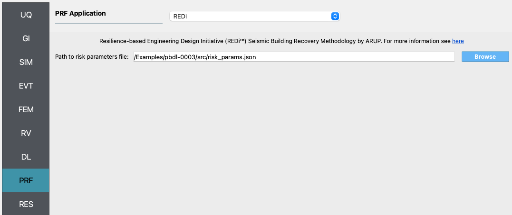
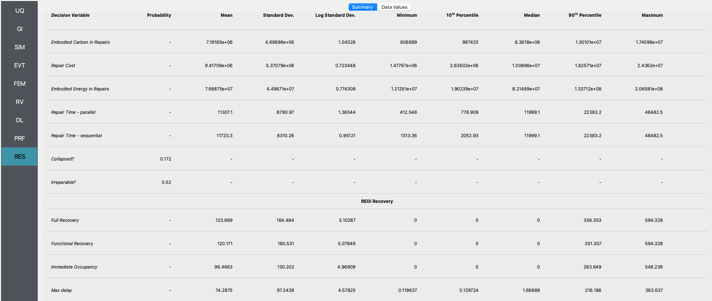
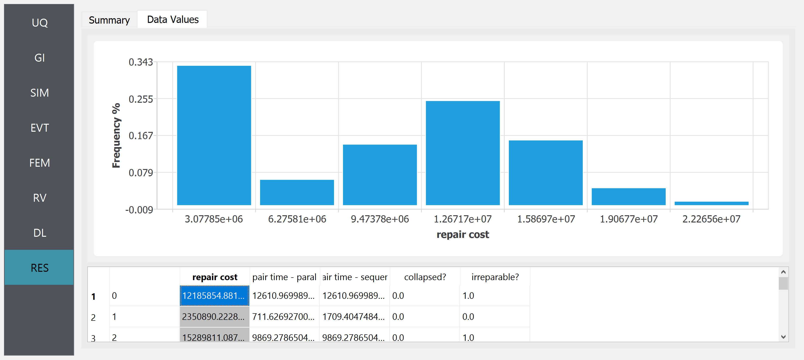

.. _pbdl-0003:

FEMA P-58 Assessment Using External Demands and REDi Recovery
=============================================================

This example is similar to **Example 1 FEMA P-58 Assessment Using External Demands**, with the addition of the REDi recovery step. 

The file ``input.json`` contains all of the settings for this Example. It can be opened (using File/Open) to automatically populate the fields in the user interface.

The demands and the performance model for this example are based on the example building featured in FEMA P-58. More details are available in the following FEMA P-58 background documentation:

.. figure:: figures/P58_background_doc.png
   :align: center
   :alt: Cover page of a technical document titled "Background Document FEMA P-58/BD-3.7.15 PACT Beta Test Example: Building B Reinforced Concrete Special Moment Frame Building." It includes two inset images of another document called "Seismic Performance Assessment of Buildings," with one showing a collapsed ceiling and the other the cover. Prepared by Curt Haselton and Travis Churapalo from California State University, Chico, and submitted to the Applied Technology Council and the Federal Emergency Management Agency (FEMA). The page features logos of FEMA, ATC, and California State University, Chico.
   :width: 400
   :figclass: align-center

The recovery methodology in this example is based on the `REDi Recovery Engine <https://www.redi.arup.com>`_:

rominently displayed in red across the mid-section of the cover. At the bottom right, there is text indicating "Version 1.0 November 2019." The cover features a clean, minimalistic design with a black and red color scheme.
   :width: 400
   :figclass: align-center

In this example, we are going to import demand data from simulations that were run outside of the PBE tool. This feature allows researchers to use PBE only for the performance assessment part of the workflow and connect it with any other response estimation solution they prefer to use. Because we do not need the response estimation part of the workflow for this example, we only need to focus on the **DL** and **PRF** panels in PBE.

DL - Asset Model
~~~~~~~~~~~~~~~~

The first tab in the **DL** panel defines the asset model. The asset model assigns components to the building and defines where they are and how much of each component is at each location.

et, among others. "Component Assignment" features buttons for loading and saving, with options to add or remove components from a database, listed as "FEMA P-58." Detailed component information, including descriptions and notes, is provided in a structured format at the bottom of the interface. The interface appears to be used for assessing building components' vulnerability and response to damage.
   :figclass: align-center

The asset model can consider uncertainties in the types of components assigned and in their quantities. This example does not introduce those uncertainties for the sake of simplicity. Consequently, for this example, the component types and their quantities are identical in all realizations.

Pelicun provides a convenience method for defining the asset model. We can prepare a table (see the figure below) where each row identifies a component and assigns some quantity of it to a set of locations and directions. Such a table can be prepared in Excel or in a text editor and saved in a CSV file - like we did in this example, see CMP_QNT.csv. Such a file is automatically created by PBE when the asset model is set up using the user interface. It can also be manually saved or the settings can be loaded from a file using the Load and Save buttons under **Component Assignment** Storing these models in a CSV file facilitates sharing the basic inputs of an analysis with other researchers.

.. figure:: figures/component_table.png
   :align: center
   :alt: A screenshot of a spreadsheet displaying various rows of data detailing construction information. Each row contains multiple fields such as ID, Units, Location, Direction, Theta, Blocks, Family, Theta_1, and Comment. The cells are filled with alphanumeric text and numbers that seem to be specifications, such as dimensions for construction materials, types of installations, and comments that provide additional details like "Midrise stick-built curtain wall" or "HVAC Stainless Steel Ducting." The spreadsheet is partially visible and the text is in a clear, readable font on a white background with grid lines separating each cell.
   :figclass: align-center

The tabular information in the csv file follows the information provided at the bottom of the Asset Model panel where the selected component is assigned to various locations and directions in the building.

We selected the built-in FEMA P-58 Component Vulnerability Database for this analysis and set the General Information features and component characteristics following the referenced example problem.

DL - Demand Model
~~~~~~~~~~~~~~~~~

The first tab defines the demand model.Under ``Data Source`` we specified that the demands are provided in a file and specified the location of that file.

r 500 entered, and another option to infer residual drifts as per FEMA P-58. The interface has a clean, professional look with shades of blue and gray.
   :figclass: align-center

Demand distribution data was extracted from the FEMA P-58 background documentation referenced in the Introduction. The nonlinear analysis results from Figures 1-14 – 1-21 provide the 10th percentile, median, and 90th percentile of EDPs in two directions on each floor at each intensity level. We used that information to fit a lognormal distribution and sample 50 realizations of EDPs that follow the data provided for stripe #4 in the original example. The EDP data is stored in the ``demands_s4.csv`` file:

d from 1 to 23 on the left side, indicating different data entries or measurements. The numbers are in a variety of ranges, indicating a dataset possibly used for analysis or reporting purposes.
   :figclass: align-center

The header of the table uses the standard SimCenter demand naming convention to identify the type, location, and direction of each EDP. Each row corresponds to one realization - such data typically would come from dynamic analysis.

One the demands are imported, the settings in the panel instruct Pelicun to fit a truncated lognormal distribution to the data considering everything above a peak interstory drift (PID) of 6% as collapsed cases. Then, sample the fitted multivariate distribution to get 500 demand realizations and use the methodology from FEMA P-58 to infer residual drifts based on PID values.

DL - Damage Model
~~~~~~~~~~~~~~~~~

We have already identified the components in the buildings and the component database includes the fragility functions that characterize component vulnerabilities through probabilistic capacities corresponding to various limit states.

We use the Damage Model tab to extend the above dataset with two Global Vulnerabilities: Irreparable Damage and Collapse.

log standard deviation sliders, and 'Collapse' with demand, capacity, and distribution parameters are visible. The Damage Process section indicates the approach used, labeled 'FEMA P-58'. The interface has a sidebar with various options including UQ, GI, SIM, EVT, FEM, RV, DL, PRF, and RES highlighted in different shades of blue and gray.
   :figclass: align-center

Irreparable damage is triggered when the residual drift of any story in the structure exceeds a pre-defined threshold. We use the recommended values from FEMA P-58 for that threshold here.

Following the typical approach in FEMA P-58 performance assessment, the collapse limit state is characterized by a collapse fragility function. The controlling variable is an IM, the spectral acceleration at T1=1.13 s. Given the multi-stripe setup of the example problem, all realizations at one stripe have the same Sa(T1) value. This value is added for every realization using an extra column in the ``demands_s4.csv`` file. The capacity, distribution, and theta_1 parameters are used to define the lognormal fragility function. Note that the capacity is provided in inches/s2 because the length unit for the analysis in the **GI** panel is set to inches.

We use the built-in FEMA P-58 damage process for this example.

DL - Loss Model
~~~~~~~~~~~~~~~

Consequence modeling is decoupled from damage modeling in Pelicun. The Loss Model tab is used to identify the consequence database for each type of consequence we would like to include in the analysis and map the consequence models to the damaged components. This process is trivial if one wants to follow the FEMA P-58 methodology and the mapping is performed automatically by the PBE tool.

lect from a FEMA P-58 database and 'Repair Consequence Types', including repair cost, repair time, and embodied carbon and energy in repairs. Below, there is a section for 'Available Consequence Models' displaying details on bolted shear tab gravity connections. Further down, a section titled 'Global Consequences' is partially visible with options for replacement, while 'Mapping' with an approach option set to 'Automatic' can be seen at the bottom of the interface.
   :figclass: align-center

We use this panel to add a replacement consequence to the FEMA P-58 dataset. This defines a replacement cost and time and the automatic mapping links these consequences with the collapse and irreparable damage events. Note that the replacement consequences are defined using random variables in this example to capture the uncertainty in those numbers. The deterministic replacement values that FEMA P-58 uses can be reproduced in PBE by choosing N/A for the Distribution of Cost and Time.

PRF - Recovery
~~~~~~~~~~~~~~

For the recovery performance assessment, the `REDi Recovery Engine <https://www.redi.arup.com>`_ is employed.

ere" with a hyperlink. Below the description, there is a field for "Path to risk parameters file:" with a filepath inputted as "/Examples/pbdl-0003/src/risk_params.json" and a "Browse" button adjacent to it. The interface includes a sidebar with various acronyms such as UQ, GI, SIM, and others, with the "PRF" tab highlighted in blue.
   :figclass: align-center

The only input is the **risk parameters** json file. The **risk parameters** file is a json file that contains the necessary inputs required by the REDi engine. Example **risk parameters** include impeding factors such as permit delay time. For a full list and an explanation of the required risk parameters, see the `Risk Parameters <https://sgavrilovicarup.github.io/REDi-docs/#risk-parameters>`_ section in the REDi documentation. 

Analysis & Results
~~~~~~~~~~~~~~~~~~

Once the performance assessment has been set up, click on the **Run** button. When the analysis is complete the **RES** tab will be activated and the results will be displayed. The **Summary** and **Data** tabs of the results panel are shown below. Since we are running the REDi recovery assessment in addition to the damage and loss, you will see the **REDi Recovery** section appear below the **DL** values. 

various metrics such as 'Embodied Carbon in Repairs,' 'Repair Cost,' 'Embodied Energy in Repairs,' 'Repair Time - parallel,' 'Repair Time - sequential,' and categories under 'RES' with probabilities for 'Collapsed?' and 'Irreparable?' and recovery values under 'REDi Recovery' for 'Full Recovery,' 'Functional Recovery,' 'Immediate Occupancy,' and 'Max delay.' Each metric contains numerical data, some cells are empty indicated by a dash.
   :figclass: align-center

 the x-axis seems to have numerical values from around 0 to 500, but the exact parameter is not visible. Below the graph, there's a section showing a data table with columns titled "id," "Carbon in Rc," "Repair Cost," "Energy in Rc repair Time - parallel," "repair Time - sequential," "Collapsed?," and "Irreparable?" with numerical values in each cell, indicating detailed data corresponding to the graph above. The interface tabs suggest viewing options such as "Summary" and "Data Values."
   :figclass: align-center

In the **Data** tab of the **RES** panel, we are presented with both a graphical plot and a tabular listing of the data. By left- and right-clicking on the individual columns the plot axis changes (left mouse click controls vertical axis, right mouse click the horizontal axis). If a singular column of the tabular data is selected with both right and left mouse buttons, a frequency and CDF plot will be displayed.