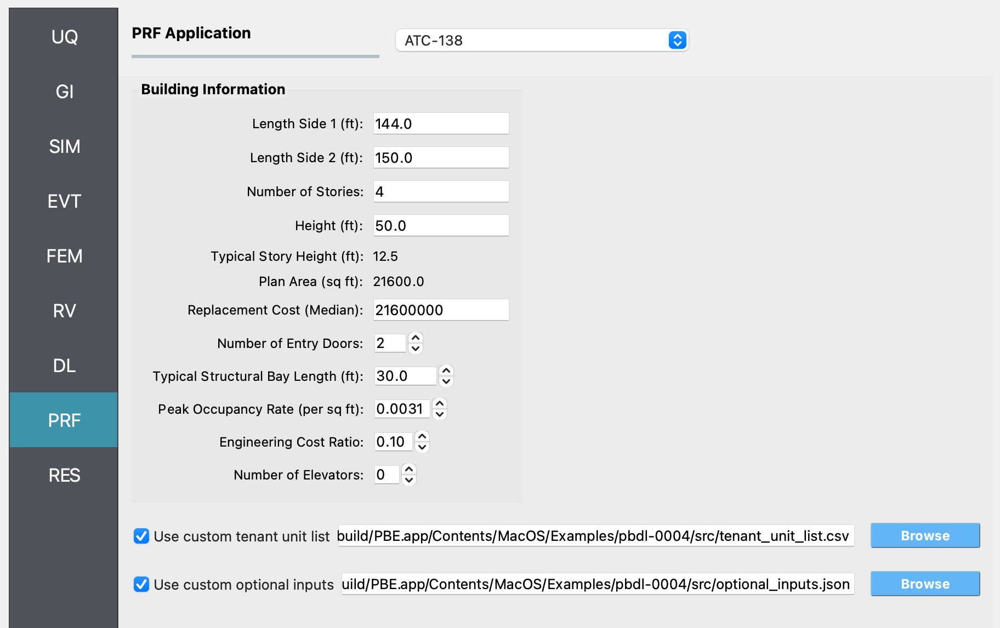
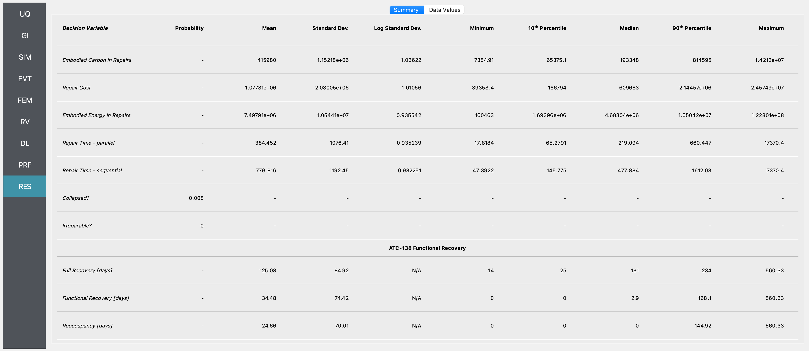

.. _pbdl-0004:

FEMA P-58 Assessment with ATC-138 Functional Recovery
=====================================================

This example extends :ref:`pbdl-0001` with an ATC-138 functional
recovery assessment. The damage and loss configuration -- asset
model, component quantities, demand model, damage model, and loss
model -- is identical to Example 1, so we do not repeat that setup
here. Refer to Example 1 for those details.

The rest of this page covers only what differs from Example 1 and
the new ATC-138 configuration. The file ``input.json`` contains all
settings for this example; open it from **File / Open** to populate
the user interface.

Demand input -- stripe 2 instead of stripe 4
~~~~~~~~~~~~~~~~~~~~~~~~~~~~~~~~~~~~~~~~~~~~

Example 1 uses ``demands_s4.csv``, which corresponds to stripe 4 of
the multi-stripe analysis in the FEMA P-58 background document. For
the functional recovery demonstration we use stripe 2 instead,
stored in ``demands_s2.csv``. Stripe 2 represents a more frequent,
lower-intensity earthquake; that reduces the probability of collapse
and irreparable damage and produces a richer mix of partial damage
states, which exercises the ATC-138 simulation more thoroughly.

PRF -- ATC-138 functional recovery
~~~~~~~~~~~~~~~~~~~~~~~~~~~~~~~~~~

The new step is the **PRF** panel. This example uses the default
values throughout the **Building Information** group -- nothing was
changed. See the :ref:`lblPRF_atc138` documentation for the meaning
of each field.

   The ATC-138 input panel populated for Example 4.

The example also enables both optional file inputs to demonstrate
their use.

Custom tenant unit list
^^^^^^^^^^^^^^^^^^^^^^^

Rather than relying on the auto-generated default (one commercial-
office tenant per story spanning the full plan area), this example
ships a custom ``tenant_unit_list.csv`` with six tenant units
distributed across the four stories:

.. csv-table:: ``tenant_unit_list.csv``
   :header: id, story, area, perim_area, occupancy_id, occupancy type
   :widths: auto

   1, 1, 21600, 7350, 1,  Commercial Office
   2, 2, 10800, 3675, 1,  Commercial Office
   3, 2, 10800, 3675, 7,  Multi-Unit Residential
   4, 3, 10800, 3675, 1,  Commercial Office
   5, 3, 10800, 3675, 7,  Multi-Unit Residential
   6, 4, 21600, 7350, 1,  Commercial Office

The ground floor (story 1) and the top floor (story 4) are each a
single full-floor commercial office occupying the entire 21,600 sq ft
plan area. Stories 2 and 3 are split equally between a commercial
office tenant and a multi-unit residential tenant, each occupying
half of the plan area. The ``perim_area`` column is the exterior
perimeter (elevation) area assigned to each tenant unit -- the full
perimeter at story height for full-floor units, half of that for the
half-floor units.

Defining the tenants this way exercises ATC-138's per-tenant fault
tree: commercial-office and multi-unit residential tenants have
different functional requirements (e.g., for sanitary water and
elevator access), so reoccupancy and functional recovery times can
differ between tenants on the same story.

Custom optional inputs
^^^^^^^^^^^^^^^^^^^^^^

The bundled ``optional_inputs.json`` is a verbatim copy of ATC-138's
built-in defaults. Loading it does not change any setting, but the
file gives you a complete, ready-to-edit list of every parameter the
assessment exposes -- impedance, repair time, and functionality
options. When you want to customize, e.g., the contractor
relationship, the funding source, or workforce caps, start from this
file and edit the relevant entries in place.

Analysis & Results
~~~~~~~~~~~~~~~~~~

Once the workflow is set up, click **Run**. When it completes, the
**RES** panel becomes active. Because ATC-138 is enabled, the
**Summary** tab shows three additional rows below the damage and
loss results: ``Reoccupancy [days]``, ``Functional Recovery [days]``,
and ``Full Recovery [days]``, each summarized with mean, standard
deviation, percentiles, and bounds.

   Summary of damage, loss, and ATC-138 functional recovery results
   for Example 4.
