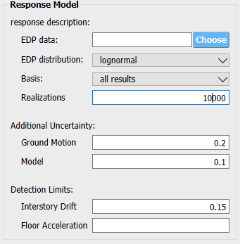
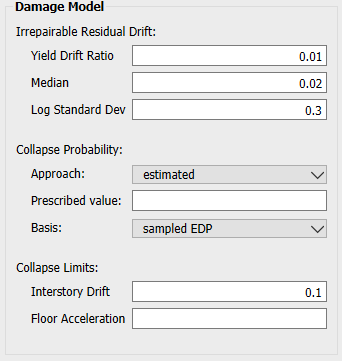
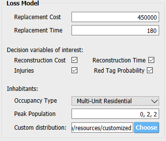
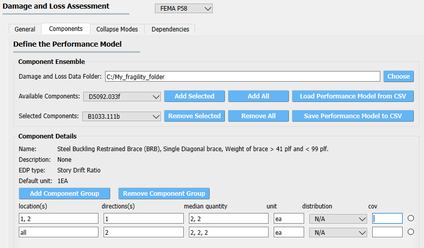
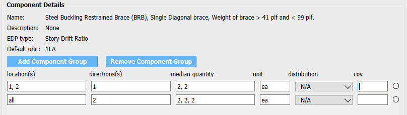
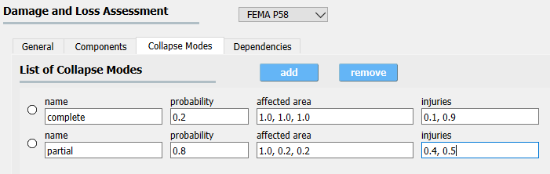
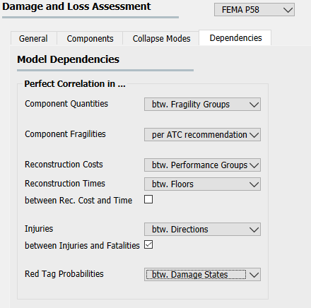
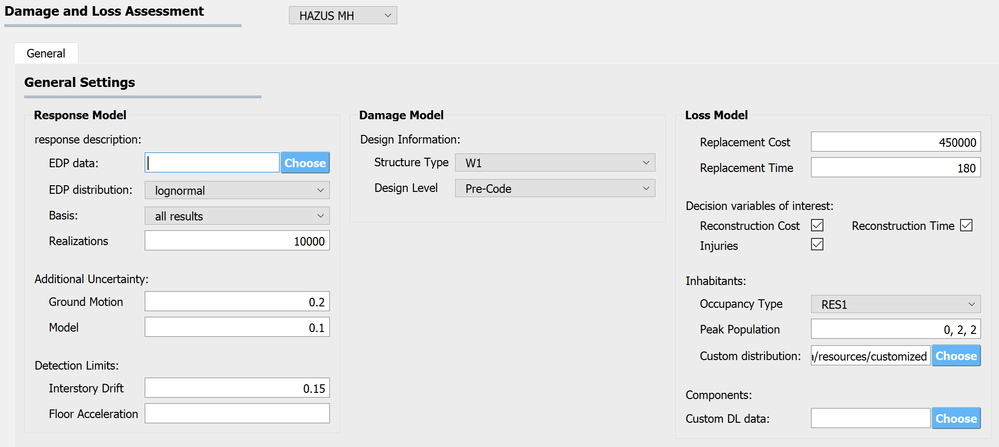
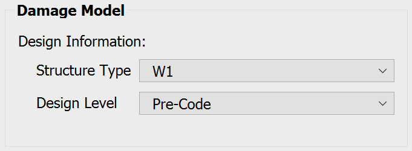
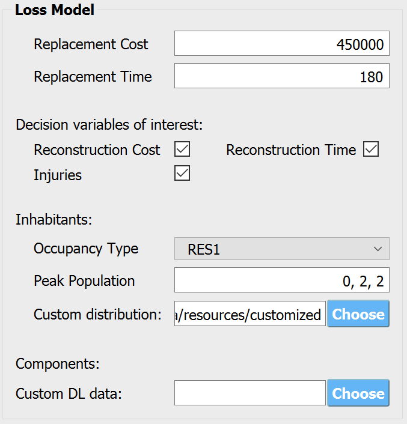

**************************
DL: Damage and Loss Model
**************************

The Damage and Loss panel provides users a convenient way to define the damage and loss model for the building. The dropdown list at the top of the panel allows users to choose between two loss-assessment methods: FEMA P58 :cite:`applied_technology_council_atc_fema_2012` and HAZUS MH :cite:`federal_emergency_management_agency_fema_hazus_2018-2`. The method chosen determines the information displayed in the rest of the panel. The two methods are discussed in the following sections.

FEMA P58
=========

This option implements the loss assessment methodology described in the `FEMA P58`_ documents. The main panel is divided into four parts that can be accessed by clicking at the tabs at the top of the input panel.

General Settings
-----------------

:numref:`fig-dl-p58-general` shows the first panel, which corresponds to general damage and loss settings. The panel allows the user to set the response, damage, and loss models for the assessment.

.. _fig-dl-p58-general:

.. figure:: figures/dl_p58_general.png
	:align: center
	:figclass: align-center

	The General Damage and Loss Settings panel. (The settings shown in the Figure serve demonstration purposes and are not the suggested inputs.)

Response Model
^^^^^^^^^^^^^^^^^

    Response model settings

Some text about the model

**Response Description**

    **EDP data**

    Allows you to provide externally calculated EDP results for the assessment. If this field is not empty, we will use the raw results in the file provided and we will not run any response simulations regardless of the settings in other parts of the application.

    **EDP distribution** 

    Specifies the approach to describing the distribution of EDPs. If empirical is selected, the raw EDPs are kept as is and resampled during the assessment. The lognormal setting fits a multivariate lognormal distribution to the EDPs. The truncated lognormal setting can be used to set a truncated multivariate lognormal distribution to the non-collapse results by setting the Basis (the next setting) appropriately.

    **Basis** 

    Specifies the basis of the EDP distribution. The all results setting uses all samples, while the non-collapse results removes the samples that have EDPs beyond the collapse limits (see in a later setting).

    **Realizations**

    The number of EDP and corresponding damage and loss realizations to generate. Depending on the complexity of the model, a few thousand realizations might be sufficient to capture central tendencies. A much larger number is required to get appropriate estimates of the dispersion of results. If the EDP distribution is set to empirical, the EDP realizations are sampled from the set of raw EDP values with replacement. If the EDP distribution is set to lognormal or truncated lognormal, the samples are generated from the distribution that is fit to the raw EDP values.

**Additional Uncertainty** 

  Ground motion and Model uncertainty per FEMA P58. The prescribed logarithmic standard deviation values are added to the dispersion of EDPs to arrive at the description of uncertain building response.

**Detection Limits** 

  These limits correspond to the maximum possible values that the response history analysis can provide. While peak interstory drifts will certainly have an upper limit, peak floor acceleration will not necessarily require such a setting. Leaving any of the fields empty corresponds to unlimited confidence in the simulation results. 

  Note: these limits will be used to consider EDP data as a set of censored samples when fitting the multivariate distribution set under Response Description. If the EDP distribution is set to empirical, this setting has no effect.

Damage Model
^^^^^^^^^^^^^^^^^

    Damage model settings

**Irrepairable Residual Drift**

  Describes the limiting residual drift as a random variable with a lognormal distribution. See Figure 2-5 and Section 7.6 in FEMA P58 for details. The prescribed yield drift ratio is used to estimate residual drifts from peak interstory drifts per Section 5.4 in FEMA P58. This is only needed if no reliable residual drifts are available from the simulation. Considering the large uncertainty in estimated residual drift values, it is recommended to consider using the peak interstory drift as a proxy even if it would be numerically possible to obtain residual drift values.

**Collapse Probability** 

	**Approach**

	  Specifies if the collapse probability shall be estimated from EDP samples, or prescribed by the user.
	
	**Prescribed value**

	  If the prescribed approach is selected above, you can specify the probability of collapse here.
	
	**Basis**

	  If the estimated approach is selected above, you can specify the basis of collapse probability estimation here. Sampled EDP corresponds to using the (re)sampled EDPs, while raw EDP corresponds to using the EDP inputs to evaluate the proportion above the collapse limits to get the collapse probability.

**Collapse Limits**
  
  If the Approach under Collapse Probability is set to estimated, the collapse of the building in each realization is inferred from the magnitude of EDPs. The collapse limits describe the EDP value beyond which the building is considered collapsed. Note that collapse limits might be beyond the detection limits (although that is generally not a good idea) and certain EDPs might not have collapse limits associated with them (e.g. PFA).

Loss Model
^^^^^^^^^^^^^^^^^

    Loss model settings

**Replacement Cost and Time**
  
  The cost (in the currency used to describe repair costs, typically US dollars) and the time (in days) it takes to replace the building.

**Decision variables of interest**
  
  These checkboxes allow the user to pick the decision variables of interest and save computation time and storage space by only focusing on those.

**Inhabitants**

	**Occupancy Type**

	  The type of occupancy is used to describe the temporal distribution of the inhabitants. Note: the default FEMA P58 distribution can be overridden by a custom file provided in the Custom Data Sources box.
	
	**Peak Population**

	  The maximum number of people present at each floor of the building. The example in \Cref{fig:dl_p58_general} shows a two-story wooden house with a cripple wall, hence the 0 population in the first floor.
	
	**Custom distribution**

	  The loss assessment is performed using population and fragility data from the first edition of FEMA P58. Each data source can be overridden by custom user-defined data.
	
	  Note: the loss calculations are performed at the local computer. Consequently, the locally available fragility and population data files can be used to perform the calculations even if the response simulations are done at DesignSafe.

Building Components
--------------------

:numref:`fig-dl-p58-comp` shows the input panel where you can define the components of the building.

.. _fig-dl-p58-comp:

	The Component Settings panel. (The settings shown in the Figure serve demonstration purposes and are not the suggested inputs.)
 

Component Ensemble
^^^^^^^^^^^^^^^^^^^^

**Damage and Loss Data Folder**

  Specifies the location of the fragility and consequence data that will be used for the damage and loss assessment. When empty, the data from the second edition of FEMA P58 is loaded by default. The corresponding json files are available in the applications folder under: 
  ``performDL/pelicun/pelicunPBE/resources/FEMA P58 second edition/DL json/`` 

  The components from the first edition of FEMA P58 are also provided with the PBE app  under the ``FEMA P58 first edition`` folder at the above location.

  Typically, you will have to edit the components provided by FEMA P58 and specify missing fragility and consequence data before they can be used for damage and loss assessment. We recommend that you copy the components you prefer to use for the assessment to another folder and perform the edits there. Then, specify that folder here. PBE will automatically load those components and show them in the ``Available Components`` list.

**Add or Remove Components**

  The ``Add Selected``, ``Add All``, ``Remove Selected``, ``Remove All`` buttons allow you to Add or Remove components from the available set to the selected one. 

  Only the components in the ``Selected Components`` list will be used during the loss assessment.

**Save Performance Model**

  You can save the assigned performance model using the ``Save Performance Model to CSV`` button. The created ``csv`` file can be loaded by Excel or Matlab allowing you to edit it and reuse it later. 

**Load Performance Model**

  If you have a pre-defined performance model available in a csv file, you can load it with the ``Load Performance Model from CSV``. Make sure you have the ``Damage and Loss Data Folder`` with the fragility definitions properly set up before loading a file that uses non-default components.

Component Details
^^^^^^^^^^^^^^^^^^^^

This panel provides more information about the active component in the drop-down menu under Selected components and allows you to specify where and what quantities of those components are in the building. 

.. _fig-dl-p58-comp-details:

    Component details

**Component Groups**

  Components are handled by defining component groups in the building. You can add a new component group definition or remove an existing one with the ``Add Component Group`` and ``Remove Component Group`` buttons. Each component group defintion allows you to assign component groups to various locations in the building.

  The following settings are available:

  :location(s): 
    In buildings, locations are typically stories. The ground floor is story 1. Providing ``all`` assigns the same setting to every story. You can use a dash to specify a range of stories, such as ``3-7``. If a component is only assigned to the top story, or the roof, you can use ``top`` or ``roof``. You can also combine these and use ``3-roof`` for example. These settings make it easy to transfer performance models between buildings that have a different number of stories.

  :direction: 
    The directions correspond to EDPs that are used to assess the fragility of the components. They shall match the directions in the EDP results available from the simulations.

  :median quantity:
    Components within a *Fragility Group* are separated into *Performance Groups* by floor and direction. Components within a *Performance Group* are further separated into *Component Groups* that might experience independent damage and losses depending on the settings in the Dependencies tab. 

    The list of quantities provided here specifies the number of *Component Groups* in each Performance Group that is created by this row. 

  :unit:
    The unit you used to specify component quantities. The default unit from the fragility database is provided among the component details above for convenience. As long as the unit belongs to the same class (i.e., length, area, etc.), you can use any of the commonly used metric or US units. Squared units are expressed by using a ``2`` after the name, such as ``ft2`` for square feet.

  :distribution:
    If you want to model the uncertainty in component quantities, select either normal or lognormal distribution here. The ``N/A`` setting corresponds to known quantities with no uncertainty.

  :cov:
    Coefficient of variation for the random distribution of component quantities. If the distribution is set to ``N/A``, this can be left blank.

As long as you want to assign the same amount of components to every floor and every direction, one component group row is sufficient. Oftentimes, you will want to have more control over component quantities because the amount of components is not identical in all floors and directions.

The example in :numref:`fig-dl-p58-comp-details` shows the assignment of Buckling Restrained Braces in a building. The first row assigns four BRBs in direction 1 to the first and second stories. The four braces are grouped in pairs (hence the ``2, 2`` entry under ``median quantity``). Damage to those two *Component Groups* can be evaluated independently. The second row assigns six braces to every floor in directon 2. These are also grouped in pairs, forming three *Component Groups*. Since the number of braces is known exactly, the ``distribution`` is set to ``N/A`` and there is no need to specifiy a ``cov`` value.

Collapse Modes
--------------------

:numref:`fig-dl-p58-collmod` shows the input panel where you can specify the collapse modes of the building.

.. _fig-dl-p58-collmod:

	The Collapse Modes panel. (The settings shown in the Figure serve demonstration purposes and are not the suggested inputs.)
 

Collapse modes provide information for the estimation of injuries from building collapse. As such, they are only used if injuries are among the requested Decision Variables. The following pieces of information are required for each collapse mode:

  :name: 
    A name that helps you identify the collapse mode. It is arbitrary and not used by the loss assessment engine.

  :probability: 
    Conditioned on collapse, the likelihood of this collapse mode.

  :affected area: 
    The affected area (as a fraction of the total plan area) of the building at each floor. We assume that the floor area is uniform along the height of the building.

  :injuries: 
    The probability of each level of injury when people are in the affected area and this collapse mode occurs. (FEMA P58 assumes two levels of severity: injuries and fatalities).

Dependencies
--------------------

.. _fig-dl-p58-deps:

	The Collapse Modes panel. (The settings shown in the Figure serve demonstration purposes and are not the suggested inputs.)

:numref:`fig-dl-p58-deps` shows the fourth panel, which allows you to control the dependencies between various parts of the models. 

Every type of prescribed dependency assumes perfect correlation between a certain subset of the model variables and no correlation between the others. Future versions will expand on this approach by introducing more complex correlation structures.

Logical components
^^^^^^^^^^^^^^^^^^^^

You can assign perfect correlation between the following logical components of the model:

**Fragility Groups**

  Assumes that the selected parameters are correlated between Fragility Groups (i.e. the highest organizational level) and at every level below. That is, with this setting, the users assigns perfect correlation between every single parameter of the selected type in the model. Use this with caution.

**Performance Groups** 
  
  Assumes that the selected parameters are correlated between all Performance Groups and at every logical level below. For instance, this setting for Component Quantities will lead to identical deviations from mean quantities among the floors and directions in the building.

**Floors**
  
  Assumes that the selected parameters are correlated between Performance Groups at various floors, but not between Performance Groups in different directions in the building. Also assumes perfect correlation between the Damage States within each Performance Group. This is useful when the parameter is direction-dependent and similar deviations are expected among all floors in the same direction.

**Directions**
  
  Assumes that the selected parameters are correlated between Performance Groups in various (typically two) directions, but not between different floors of the building. This can be useful when you want to prescribe similar deviations from mean values within each floor, but want to allow independent behavior over the height of the building.

**Damage States**
  
  Correlation at the lowest organizational level. Assumes that the selected parameters are correlated between Damage States only. This type of correlation, for instance, would assume that deviation from the median reconstruction cost is due to factors that affect all types of damage within a performance group in identical fashion.

Model parameters
^^^^^^^^^^^^^^^^^^^^

The following model parameters can handle the assigned dependencies:

**Component Quantities**

  The amount of components in the building (see the description of the Components tab below for more details).

**Component Fragilities**

  Each Damage State has a corresponding random EDP limit. The component fragilities is a collection of such EDP limit variables.

  Note: most methodologies assume that such EDP limits are perfectly correlated at least among the Damage States within a Component Subgroup.

**Reconstruction Costs and Times**

  The cost and time it takes to repair a particular type of damage to a component. The btw. Rec. Cost and Time checkbox allows you to define correlation between reconstruction cost and time on top of the correlations already set above for each of these individually.

  Note: if you do define such a correlation structure, the more general correlation among the settings in the Reconstruction Costs and Reconstruction Times lines will need to be applied to both cases to respect conditional correlations in the system. (e.g., if you set costs to be correlated between Performance Groups and times to correlate between Floors and check the cost and time correlation as well, times will be forced to become correlated between Performance Groups.)

**Injuries**

  The probability of being injured at a given severity when being in the affected area of a damaged component. Note that the Injuries lines prescribe correlations between the same level of injury at different places in the building. Correlation between different levels of injury at the same place can be prescribed by the btw. Injuries and Fatalities checkbox.

**Red Tag Probabilities**

  The amount of damage in a given Damage State that triggers an unsafe placard or red tag.

The default FEMA P58 setting assumes that all variables are independent, except for the fragility data, where the fragilities of certain *Component Groups* (i.e. groups of components with identical behavior within Performance Groups) are perfectly correlated. This behavior is achieved by setting every other dependency to ``Independent`` and setting the ``Component Fragilities`` to ``per ATC recommendation``.

HAZUS MH
=========

This option implements the loss assessment methodology described in the `HAZUS MH Technical Manual`_ document.

General Settings
-----------------

:numref:`fig-dl-hazus-general` shows the input panel that allows the user to set the response, damage, and loss models for the assessment.

.. _fig-dl-hazus-general:

	The General Damage and Loss Settings panel. (The settings shown in the Figure serve demonstration purposes and are not the suggested inputs.)

Response Model
^^^^^^^^^^^^^^^^^

.. figure:: figures/dl_hazus_general_response.png
    :align: right
    :figwidth: 300px

    Response model settings

Some text about the model

**Response Description**

    **EDP data**

    Allows you to provide externally calculated EDP results for the assessment. If this field is not empty, we will use the raw results in the file provided and we will not run any response simulations regardless of the settings in other parts of the application.

    **EDP distribution** 

    Specifies the approach to describing the distribution of EDPs. If empirical is selected, the raw EDPs are kept as is and resampled during the assessment. The lognormal setting fits a multivariate lognormal distribution to the EDPs. The truncated lognormal setting can be used to set a truncated multivariate lognormal distribution to the non-collapse results by setting the Basis (the next setting) appropriately.

    **Basis** 

    Specifies the basis of the EDP distribution. The all results setting uses all samples, while the non-collapse results removes the samples that have EDPs beyond the collapse limits (see in a later setting).

    **Realizations**

    The number of EDP and corresponding damage and loss realizations to generate. Depending on the complexity of the model, a few thousand realizations might be sufficient to capture central tendencies. A much larger number is required to get appropriate estimates of the dispersion of results. If the EDP distribution is set to empirical, the EDP realizations are sampled from the set of raw EDP values with replacement. If the EDP distribution is set to lognormal or truncated lognormal, the samples are generated from the distribution that is fit to the raw EDP values.

**Additional Uncertainty** 

  Ground motion and modeling uncertainty per FEMA P58 that is referred to as uncertainty in response due to variability of ground motion demand and variability in the capacity properties of the model building in HAZUS MH. The prescribed logarithmic standard deviation values are added to the dispersion of EDPs to arrive at the description of uncertain building response.

**Detection Limits** 

  These limits correspond to the maximum possible values that the response history analysis can provide. While peak interstory drifts will certainly have an upper limit, peak floor acceleration will not necessarily require such a setting. Leaving any of the fields empty corresponds to unlimited confidence in the simulation results.

  Note: these limits will be used to consider EDP data as a set of censored samples when fitting the multivariate distribution set under Response Description. If the EDP distribution is set to empirical, this setting has no effect.

Damage Model
^^^^^^^^^^^^^^^^^

    Damage model settings

**Structure Type and Design Level**

  These two pieces of information are used to select the appropriate fragility and consequence functions from those provided in the HAZUS MH Tehcnical Manual.

  Note: Any fragility or consequences function can be edited by the user and loaded by specifying a directory that contains those custom functions in the Custom DL data box at the bottom right. The loss calculations are performed at the local computer. Consequently, the locally available fragility and population data files can be used to perform the calculations even if the response simulations are done at DesignSafe.

Loss Model
^^^^^^^^^^^^^^^^^

    Loss model settings

**Replacement Cost and Time**
  
  The cost (in the currency used to describe repair costs, typically US dollars) and the time (in days) it takes to replace the building.

**Decision variables of interest**
  
  These checkboxes allow the user to pick the decision variables of interest and save computation time and storage space by only focusing on those.

**Inhabitants**

	**Occupancy Type**

	  The type of occupancy is used to describe the temporal distribution of the inhabitants. Note: the default HAZUS MH distribution can be overridden by a custom file provided in the Custom distribution box.
	
	**Peak Population**

	  The maximum number of people present at each floor of the building. The example shows a two-story wooden house with a cripple wall, hence the 0 population in the first floor.
	
	**Custom distribution**

	  The loss assessment is performed using population data from the HAZUS Technical Manual. Each data source can be overridden by custom user-defined data.
	
	  Note: the loss calculations are performed at the local computer. Consequently, the locally available fragility and population data files can be used to perform the calculations even if the response simulations are done at DesignSafe.

**Components**

  **Custom DL data**

    The loss assessment is performed using fragility and loss data from the HAZUS Technical Manual. Each data source can be overridden by custom user-defined data.

.. bibliography:: ../../references.bib

.. _FEMA P58: https://www.fema.gov/media-library/assets/documents/90380
.. _HAZUS MH Technical Manual: https://www.fema.gov/media-library-data/20130726-1820-25045-6286/hzmh2_1_eq_tm.pdf